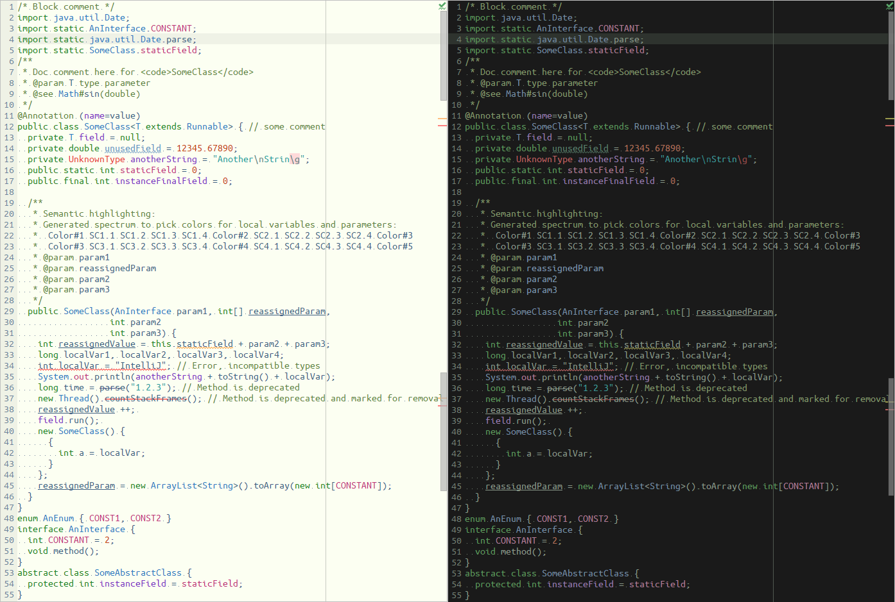
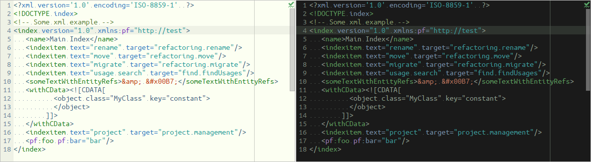

Candy Paper - Light & Dark Color Schemes for IntelliJ IDEA
===================================================================

Candy Paper provides light & dark color schemes for IntelliJ IDEA.

See also:
* [CandyPaper.vim](https://github.com/dfxyz/CandyPaper.vim) -
    color schemes for Vim
* [CandyPaper.mintty](https://github.com/dfxyz/CandyPaper.mintty) -
    color schemes for mintty

Snapshots:

