CandyPaper - A Dark Scheme for JetBrains' IntelliJ IDEA and PyCharm
===================================================================

CandyPaper is a dark color scheme for **Vim** and **GVim** inspired by
[PaperColor (Dark Version)](https://github.com/NLKNguyen/papercolor-theme) and 
[CandyCode](http://www.vim.org/scripts/script.php?script_id=1635).

And now I adapted it for JetBrains' **IntelliJ IDEA** and **PyCharm**.

## Color Table
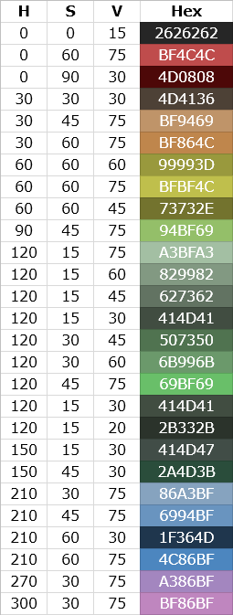

## Preview
### General
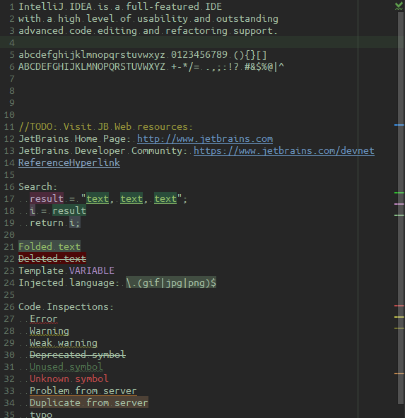

### Language Defaults
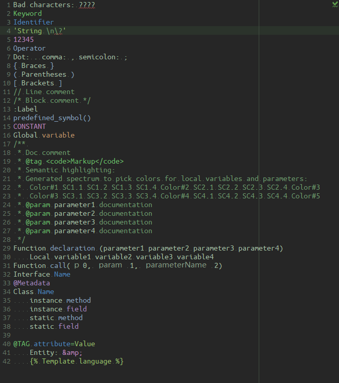

### Java
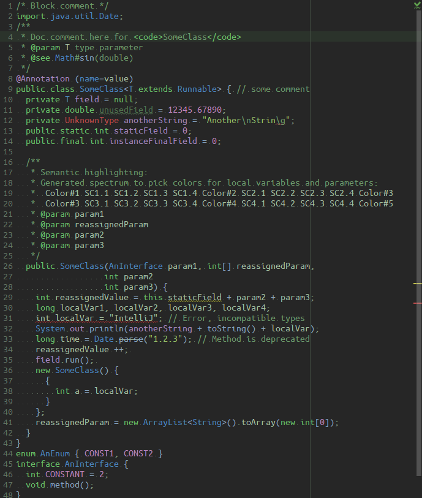

### Python
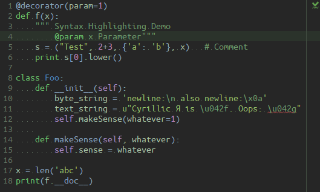

### Kotlin
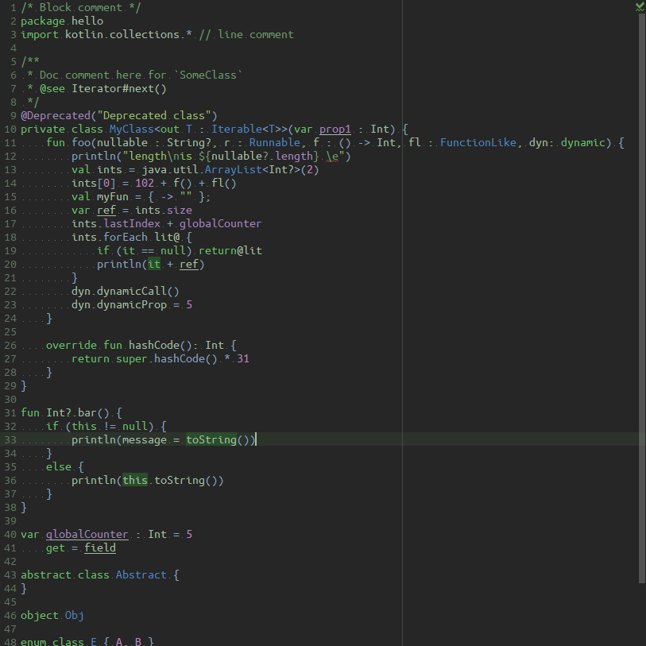

### Groovy
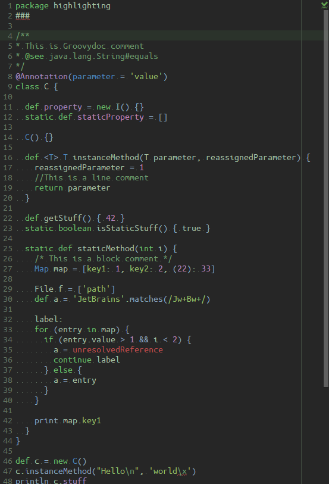

### HTML
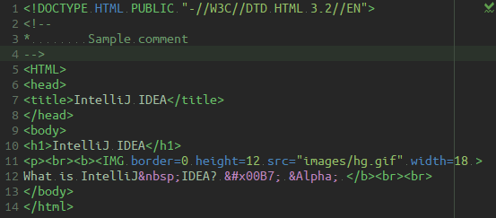

### XML
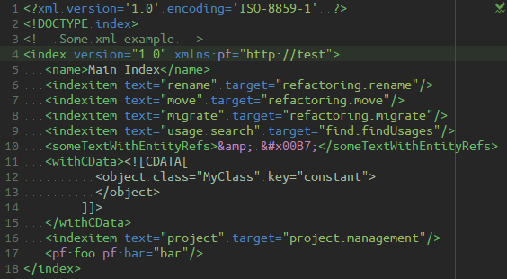

### JSON
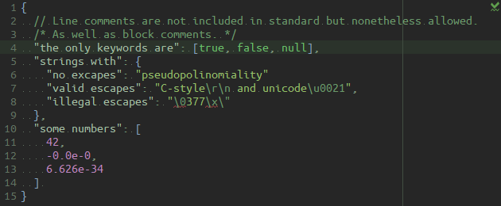

### reStructure Text
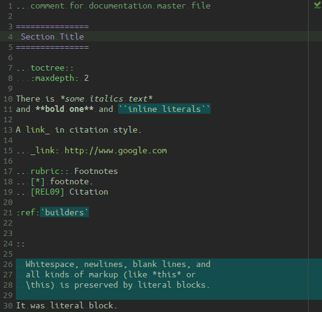

### Console
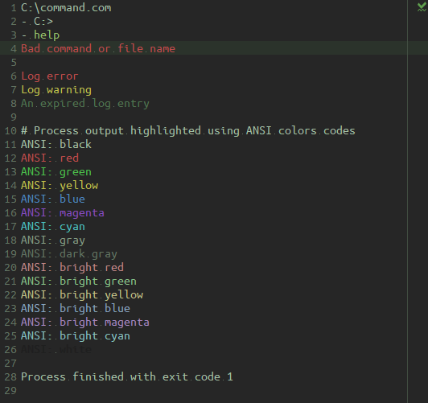

### Diff / Merge

### VCS
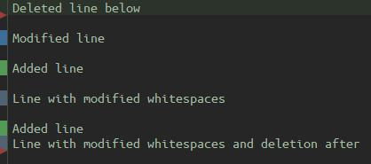

### Custom
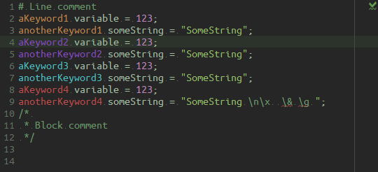
